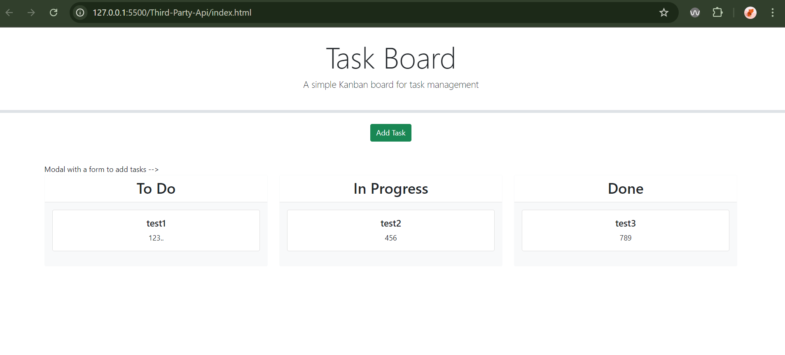

# Third-Party-Api

Third-Party API is a tool used to manage and organize tasks related to integrating and working with third-party APIs in software development projects. It provides a visual and structured way to track progress, assign tasks, and prioritize work involving APIs that are external to the organization or project. 

Screen Shots:

Built With:
javascript
css
html
github
vscode

Contributing:
https://github.com/othneildrew/Best-README-Template/blob/main/README.md

original repo: https://github.com/AndrewBrown77/module-5

 If you have a suggestion that would make this better, please fork the repo and create a pull request. You can also simply open an issue with the tag "enhancement". Don't forget to give the project a star! Thanks again
